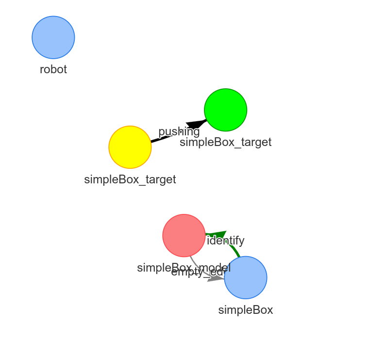

## Bug report 

# Loop by empty edge:

Caused by: 
  Somehow the halgroithm incorrectly want to free the path of the object that should be pushed toward a target configuration. How can it be that the object must be freed from a path. That is not correct. 

# motion planner can somethimes does not detect a blocking object

